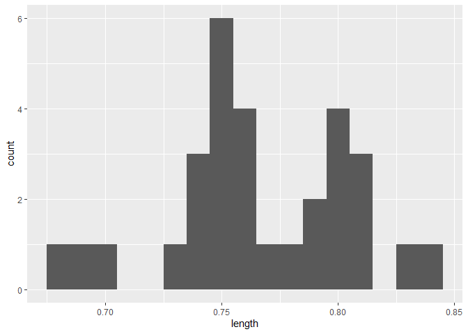

Eurytermora herdmani Size Results
================
2025-03-18

- [Exploratory Data Analysis](#exploratory-data-analysis)

## Exploratory Data Analysis

1 size data for ARM vertical tow, We want to confirm tnat there are two
different size morphs in this collection.

We have 30 size measurements to work with

``` r
ggplot(size_data, aes(x = length)) +
       geom_histogram(binwidth = 0.01) 
```



The histogram is showing 2 distinct peaks which supports the hypothesis
that there are two different size morphs.
